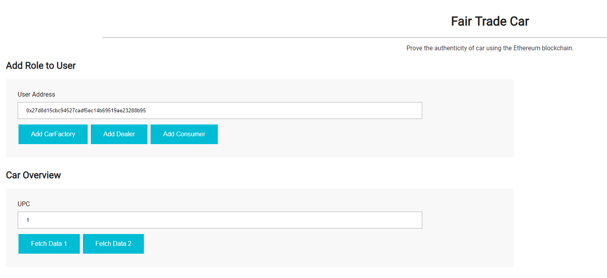
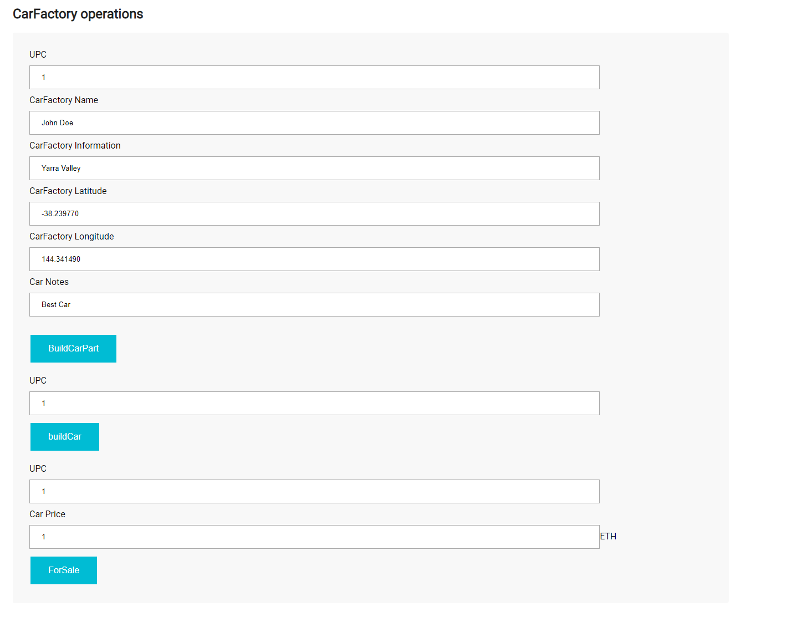
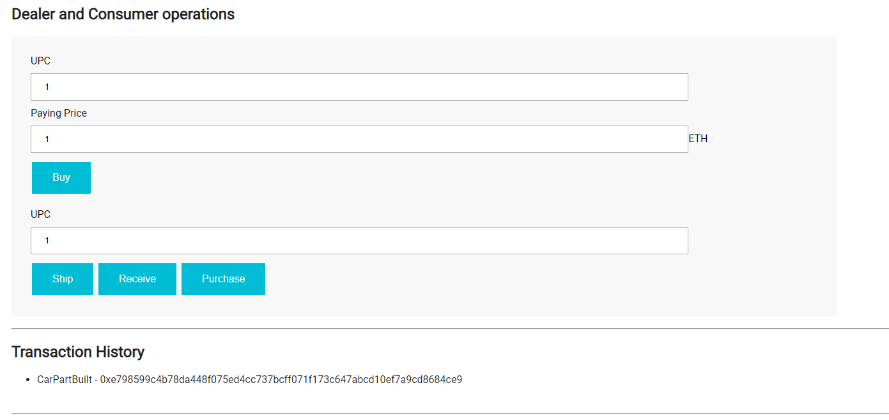

# Project #6 Part B Automotive Supply chain & data auditing

This repository containts an Ethereum DApp that demonstrates a Supply Chain flow between a Seller and Buyer. The user story is similar to any commonly used supply chain process. A Seller can add items to the inventory system stored in the blockchain. A Buyer can purchase such items from the inventory system. Additionally a Seller can mark an item as Shipped, and similarly a Buyer can mark an item as Received.

## Architecture - UML (Part B)

### Activity Diagram


### Sequence Diagram


### State Diagram


### Class Diagram


## User Interface
The DApp User Interface when running should look like...







## Transaction hash ID in Rinkeby

```
CarFactory - 0x2192fb2c40565a3befbbfd5f322b8ce5d98da62e883a5cd4718191fca7d5c660
Dealer - 0x4f7047fc58468d009aa052ef00f9df6be92127031966838952bb4f64fbc4f449
Consumer - 0x806b714125e38dca0313785e050c26177c2377bfb9e5a927ebbe4053a438632e
SupplyChain - 0x1379d870e6777e972dba41086bcaf36ad267975132bab3ec72917e52529250d4

```

## Contract Address in Rinkeby

```
CarFactory - 0xD2e9496c9Aa4aB9A063966810b4A417b6C0c9a49
Dealer - 0xD39995C9C2cF7b1c3aA02763c6D5a36785B8b653
Consumer - 0xe1F0b3314080C6D71Eda51E116B4ecb12FB4fA4D
SupplyChain - 0xF9Da3dEdD0D0A2a9a0A20cEE57495Aa3c4335e2E
```

## Built With

* [Ethereum](https://www.ethereum.org/) - Ethereum is a decentralized platform that runs smart contracts.
* [Metamask](https://metamask.io/) - It allows you to run Ethereum dApps right in your browser without running a full Ethereum node.
* [Truffle](https://www.trufflesuite.com/truffle) - Truffle is a world class development environment, testing framework and asset pipeline for blockchains using the Ethereum Virtual Machine (EVM), aiming to make life as a developer easier.
* [Ganache](https://www.trufflesuite.com/ganache) - Ganache is a personal blockchain for Ethereum development you can use to deploy contracts, develop your applications, and run tests.
* [Infura](https://infura.io/) - Provide secure, reliable, and scalable access to Ethereum and IPFS. 

#### dependencies:
* truffle: version "^5.0.25"
* truffle-assertions: version "^0.9.1"
* truffle-hdwallet-provider: version "^1.0.12"
* web3: version "^1.0.0-beta.55"

## Getting Started

These instructions will get you a copy of the project up and running on your local machine for development and testing purposes. See deployment for notes on how to deploy the project on a live system.

### Prerequisites

Please make sure you've already installed ganache-cli, Truffle and enabled MetaMask extension in your browser.

To install and verify run the following commands.

ganache-cli:
```
npm install -g ganache-cli
ganache-cli --version
```
Truffle:
```
npm install -g truffle
truffle version
```
for MetaMask make sure you have installed the MetaMask extension in your browser and logged in. [Link to download](https://metamask.io/) 

### Installing

A step by step series of examples that tell you have to get a development env running

Clone this repository:

```
git clone https://github.com/abdulelahx10/Udacity_P6_PartB_Ethereum_Dapp_for_Supply_Chain.git
```

Change directory to ```project-6``` folder and install all requisite npm packages (as listed in ```package.json```):

```
cd project-6
npm install
```

Launch Ganache:

```
ganache-cli -m "spirit supply whale amount human item harsh scare congress discover talent hamster"
```

Your terminal should look something like this:


In a separate terminal window, Compile smart contracts:

```
truffle compile
```

Your terminal should look something like this:


This will create the smart contract artifacts in folder ```build\contracts```.

Migrate smart contracts to the locally running blockchain, ganache-cli:

```
truffle migrate --reset
```

Your terminal should look something like this:


Test smart contracts:

```
truffle test
```

All 10 tests should pass.


In a separate terminal window, launch the DApp:

```
npm run dev
```

## Authors

* **Abdulelah Alshalhoub** - [abdulelahx10](https://github.com/abdulelahx10)

## Acknowledgments

* Solidity
* Ganache-cli
* Truffle