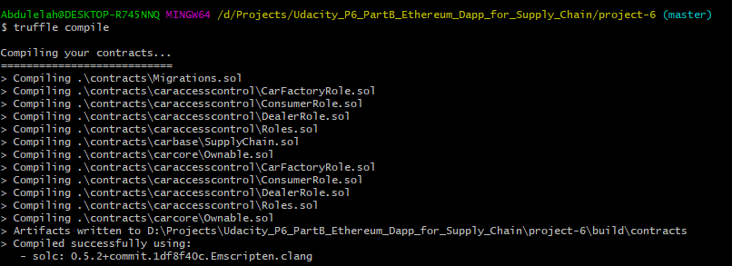

# Project #6 Part B Automotive Supply chain & data auditing

This repository containts an Ethereum DApp that demonstrates a Supply Chain flow between a Seller and Buyer. The user story is similar to any commonly used supply chain process. A Seller can add items to the inventory system stored in the blockchain. A Buyer can purchase such items from the inventory system. Additionally a Seller can mark an item as Shipped, and similarly a Buyer can mark an item as Received.

## Architecture - UML (Part B)

### Activity Diagram


### Sequence Diagram


### State Diagram


### Class Diagram


## User Interface (Remove?)
The DApp User Interface when running should look like...

## Contract Address

```
CarFactory - 0x0000000000000000000000000000000000000000
Dealer - 0x0000000000000000000000000000000000000000
Consumer - 0x0000000000000000000000000000000000000000
SupplyChain - 0x0000000000000000000000000000000000000000
```

## Transaction Hashes

```
STATE - 0x0000000000000000000000000000000000000000000000000000000000000

```

## Built With

* [Ethereum](https://www.ethereum.org/) - Ethereum is a decentralized platform that runs smart contracts.
* [Metamask](https://metamask.io/) - It allows you to run Ethereum dApps right in your browser without running a full Ethereum node.
* [Truffle](https://www.trufflesuite.com/truffle) - Truffle is a world class development environment, testing framework and asset pipeline for blockchains using the Ethereum Virtual Machine (EVM), aiming to make life as a developer easier.
* [Ganache](https://www.trufflesuite.com/ganache) - Ganache is a personal blockchain for Ethereum development you can use to deploy contracts, develop your applications, and run tests.
* [Infura](https://infura.io/) - Provide secure, reliable, and scalable access to Ethereum and IPFS. 
* Libraries:
  * ???

## Getting Started

These instructions will get you a copy of the project up and running on your local machine for development and testing purposes. See deployment for notes on how to deploy the project on a live system.

### Prerequisites

Please make sure you've already installed ganache-cli, Truffle and enabled MetaMask extension in your browser.

```
Give examples (to be clarified)
```

### Installing

A step by step series of examples that tell you have to get a development env running

Clone this repository:

```
git clone https://github.com/udacity/nd1309/tree/master/course-5/project-6
```

Change directory to ```project-6``` folder and install all requisite npm packages (as listed in ```package.json```):

```
cd project-6
npm install
```

Launch Ganache:

```
ganache-cli -m "spirit supply whale amount human item harsh scare congress discover talent hamster"
```

Your terminal should look something like this:


In a separate terminal window, Compile smart contracts:

```
truffle compile
```

Your terminal should look something like this:



This will create the smart contract artifacts in folder ```build\contracts```.

Migrate smart contracts to the locally running blockchain, ganache-cli:

```
truffle migrate
```

Your terminal should look something like this:


Test smart contracts:

```
truffle test
```

All 10 tests should pass.


In a separate terminal window, launch the DApp:

```
npm run dev
```

## Authors

* **Abdulelah Alshalhoub** - [abdulelahx10](https://github.com/abdulelahx10)

## Acknowledgments

* Solidity
* Ganache-cli
* Truffle